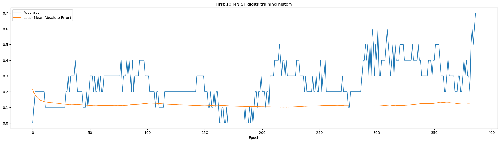

# 🌄 Graia

An *experimental* neural network library.

## Goals

- *Not* using a retropropagation algorithm for training. Retropropagation works pretty well but the main goal of this project is to find a training algorithm that would work using only the information available *locally* to the nodes. Current status: not working 😅, as the learning curves reach a plateau:  The current algorithm is based on the simple Hebbian learning rule *"Nodes that fire together, wire together."*, meaning that the weight between a sending and a receiving node increases if the two nodes are active at the same time.
- Using bit shifting instead of multiplication for faster computations. A kind of generalization of [BitNet b1.58](https://arxiv.org/pdf/2402.17764).
- Written in [Futhark](https://futhark-lang.org/) to leverage OpenCL for GPU acceleration.
- Python API similar to [TensorFlow](https://www.tensorflow.org/).

## Online Demo

There is a painfully slow (no GPU) Python build online demo available on [HuggingFace](https://huggingface.co/spaces/LaurentPayot/Graia).

For Graia to be usable, you’ll have to use it locally with a GPA as described below.

## Prerequisites

To build Graia on a Debian/Ubuntu system, you need:

- [Futhark](https://futhark.readthedocs.io/en/stable/installation.html#installing-from-a-precompiled-snapshot)
- [Futhark FFI](https://github.com/pepijndevos/futhark-pycffi) `pip install futhark-ffi`
- OpenCL
  - Native GPU drivers are prefered but if no OpenCL device is listed with `clinfo -l` you can install `pocl-opencl-icd` (slower and sometimes buggy).
  - If missing *CL/cl.h* error, install `opencl-headers`.
  - If missing *-lOpenCL* error, create an OpenCL link: `sudo ln -s /usr/lib/x86_64-linux-gnu/libOpenCL.so.1 /usr/lib/libOpenCL.so`.

Then simply run `make` to test and compile the Futhark files to the OpenCL library used by the `Graia` Python class.

## Jupyter Notebooks

To be sure to have all the Python packages needed, [Anaconda](https://docs.anaconda.com/free/anaconda/install/linux/) is highly recommended.
- Install [Futhark FFI](https://github.com/pepijndevos/futhark-pycffi): `pip install futhark-ffi`.
- As mentioned above, Native GPU drivers are prefered but if they don’t work you can Install [PoCL](http://portablecl.org/):`conda install conda-forge::pocl`.

## TODO

- Find a working training algorithm 😅
- Save/load model https://documen.tician.de/pyopencl/array.html#pyopencl.array.Array.get then https://numpy.org/devdocs/reference/generated/numpy.save.html
- More Futhark tests
